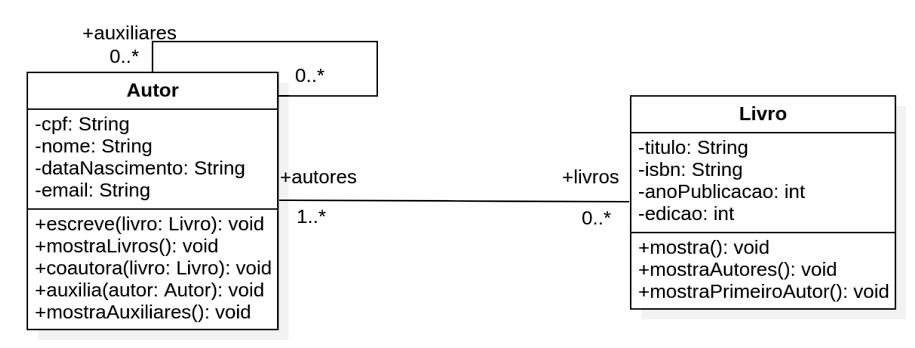

# Exercicio_LivroAutor
Resolução de exercício proposto na matéria de programação orientada à objeto Conforme a descrição à baixo: 

Considere o problema especificado a seguir: 

  Imagine que você está desenvolvendo um sistema de gerenciamento de
editora de livros e precisa modelar as classes Livro e Autor, bem como seus
relacionamentos. Crie essas duas classes em Java, seguindo o diagrama de
classes dado abaixo e use a descrição a seguir para guiar sua implementação. 
  A classe Livro deve conter os seguintes atributos: título, ISBN, ano de
publicação e edição. Um livro pode ser escrito por pelo menos um ou mais
autores. Por meio de instâncias da classe Livro é possível mostrar as
informações de um determinado livro, mostrar qual é o primeiro autor do livro
e quais são os autores. Use um arranjo para armazenar os autores e considere
como primeiro autor aquele que está na primeira posição do arranjo.  
  A classe Autor deve conter os seguintes atributos: CPF, nome, data de
nascimento e e-mail. Um autor pode escrever um livro, sendo assim seu
primeiro autor. Um autor também pode coautorar um livro, sendo um dos
escritores, mas não o primeiro autor. Um autor pode ser primeiro autor ou
coautor de vários livros. Por meio de instâncias da classe autor é possível
mostrar quais são os livros nos quais o autor teve algum tipo de participação.
Adicionalmente, permita a possibilidade de um autor ser auxiliar de outro, isso
é possível quando um autor assessora outro escrevendo um prefácio, por
exemplo. Um autor pode auxiliar ou ser auxiliado por nenhum ou muitos outros
autores.  
  Construtores não estão explicitados no diagrama e podem ser
implementados segundo a sua necessidade. Para todos os arranjos, considere
um tamanho máximo de 10 posições.  
  Após criar as classes, crie um programa exemplo que crie instâncias de
livros e autores e demonstre como os relacionamentos funcionam, incluindo
exemplos de livros escritos por vários autores e autores que são auxiliares de
outros. Garanta que todos os métodos sejam testados.  

